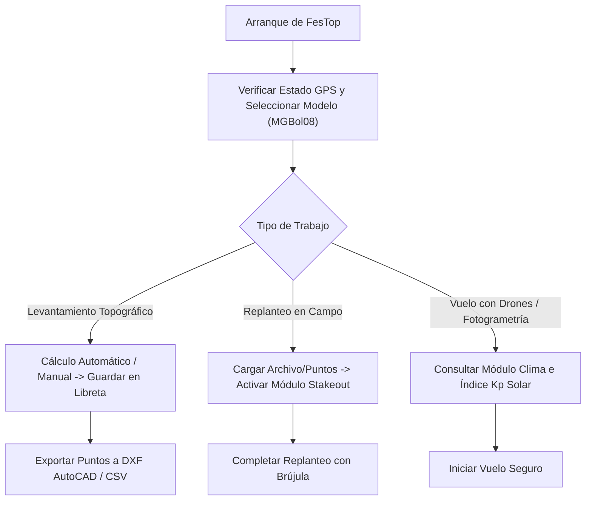

# 🗺️ Guía General y Tutorial de Uso: FesTop (factorEscala v2.4)

Bienvenido a la documentación y tutoriales de usuario de **FesTop / factorEscala v2.4**, la solución integral para cálculos topográficos, geodesia, libreta de campo, replanteo (*stakeout*) y análisis meteorológico de campo en Bolivia y Latinoamérica.

---

## 📚 Índice de Flyers Didácticos

Sigue los flyers didácticos paso a paso para dominar cada uno de los módulos de la aplicación:

1. **[01. Inicio y Configuración de Modelos Geoidales](01_FLYER_INICIO_Y_CONFIGURACION.md)**
   - Configuración inicial, selección de modelos geoidales **MGBol08** / **EGM96** y estado del GPS.
2. **[02. Cálculos Topográficos y Factor Combinado](02_FLYER_CALCULO_TOPOGRAFICO_MGBOL08.md)**
   - Transformación de coordenadas UTM / Geodésicas, cálculo manual/automático y factor de escala/altura.
3. **[03. Libreta de Campo y Exportación de Puntos](03_FLYER_LIBRETA_DE_CAMPO_Y_EXPORTACION.md)**
   - Almacenamiento de puntos de control y exportación en formatos **TXT**, **CSV** y **DXF (AutoCAD)**.
4. **[04. Módulo de Replanteo (Stakeout) y Brújula](04_FLYER_MODO_REPLANTEO_STAKEOUT.md)**
   - Replanteo de puntos en terreno con brújula de precisión, anillos de proximidad y alertas sonoras.
5. **[05. Módulo Clima, Presión Barométrica y Seguridad de Vuelo Drones](05_FLYER_CLIMA_PRESION_Y_DRONES.md)**
   - Monitoreo meteorológico, calibración de altímetro y análisis de actividad solar Kp para vuelos fotogramétricos.
6. **[06. Licencia, Soporte y Chakana Technologies](06_FLYER_LICENCIAS_SOPORTE_CHAKANA.md)**
   - Información de 1 año libre de uso, extensión a uso indefinido y contacto oficial con **Chakana Technologies**.

---

## 💡 Flujo de Trabajo en Campo Recomendado

---

> [!TIP]
> **Chakana Technologies - Soluciones de Software a Medida**  
> Para consultas técnicas, actualización de licencias o proyectos a medida, visita nuestro portal oficial:  
> 👉 **[chakanatechnologies.netlify.app](https://chakanatechnologies.netlify.app/)**
