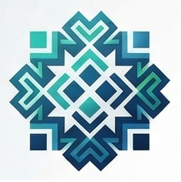

# 🚀 Flyer 01: Inicio y Configuración de Modelos Geoidales

Este tutorial explica el arranque inicial de la aplicación **FesTop / factorEscala v2.4**, la configuración de parámetros y la selección entre el modelo geoidal oficial **MGBol08** y el estándar global **EGM96**.

---

## 📸 Vista de Configuración Principal

---

## 🛠️ Paso a Paso para la Configuración Inicial

### Paso 1: Apertura de Ajustes
- Abre el menú lateral o presiona el ícono de **Ajustes** en la barra superior.

### Paso 2: Selección del Modelo Geoidal
1. **MGBol08 (Modelo Geoidal Bolivia 2008)** `[Recomendado]`:
   - Basado en el modelo EGM2008 ajustado específicamente a la topografía boliviana. Otorga altimetría de alta precisión en todo el territorio nacional.
2. **EGM96 (Global)**:
   - Modelo geoidal estándar internacional utilizado para proyectos fuera de Bolivia o mediciones globales.

### Paso 3: Calibración Barométrica
- Ingresa el offset de presión de la zona de trabajo en hPa para calibrar el altímetro barométrico de tu teléfono.

---

> [!NOTE]
> **Persistencia Automática**  
> Tu selección de modelo geoidal se guarda automáticamente en `SharedPreferences` para que no tengas que reconfigurarla en posteriores sesiones.
